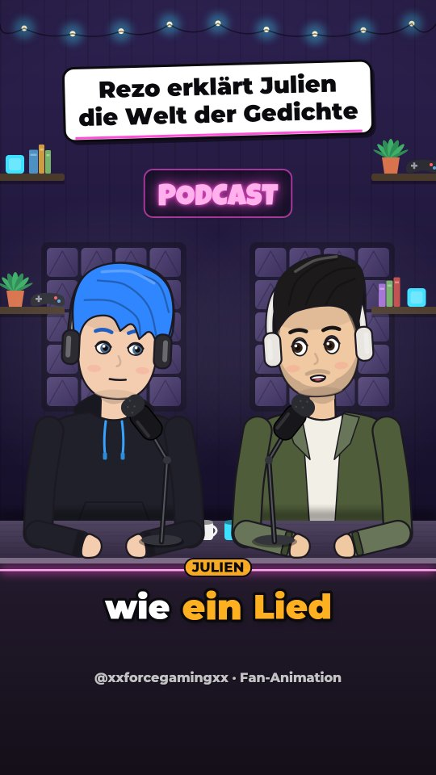
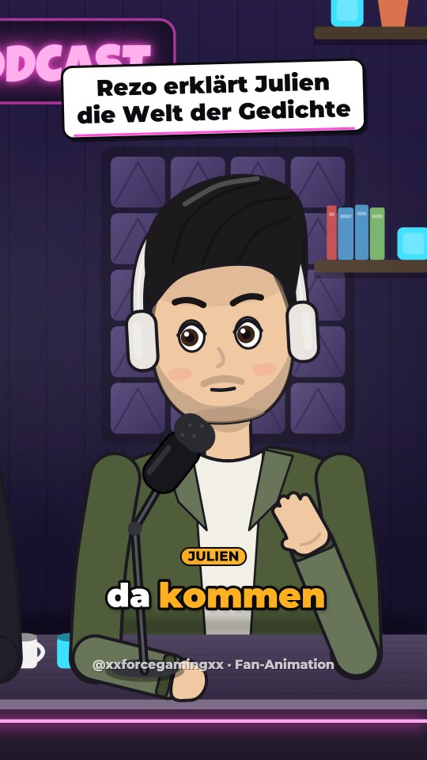
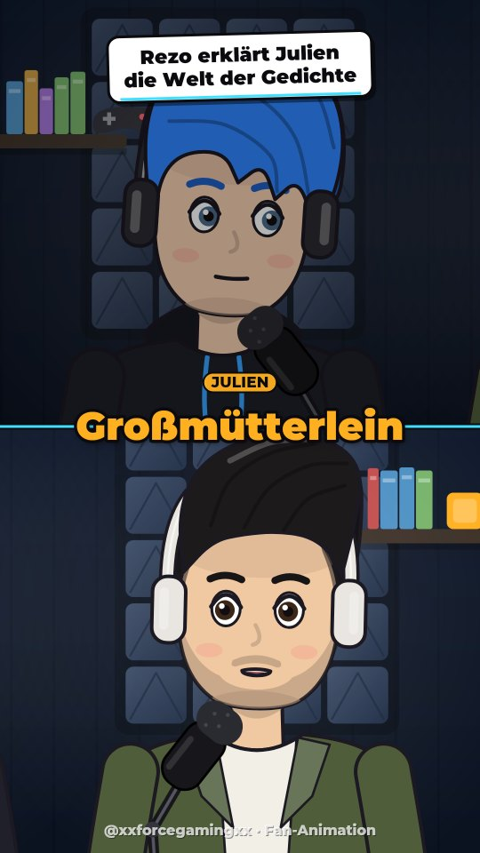

# 🎙️ Podcast Animator

Verwandelt Podcast-Ausschnitte **automatisch** in animierte YouTube Shorts (9:16) – mit gezeichneten Figuren,
die am Podcast-Tisch sitzen und reden, Lippensynchronität, Kamera-Schnitten und Untertiteln im Shorts-Stil.
Gebaut für den Kanal **xxforcegamingxx** mit Rezo- und Julien-Figuren – funktioniert aber mit jedem Podcast.

Alles läuft **lokal auf deinem PC**: Spracherkennung, Sprechererkennung und das Rendern. Optional kann
Claude (KI) die besten Stellen auswählen und Titel schreiben.

| Totale | Nahaufnahme | Split-Screen |
|---|---|---|
|  |  |  |

---

## Was das Programm macht

1. **Datei rein** – ganze Podcast-Folge, ein Ausschnitt oder nur die Audiospur (MP4, MKV, MOV, WEBM, MP3, WAV, M4A …).
   Optional nur einen Zeitbereich verarbeiten (z.B. `1:02:30` bis `1:04:00`).
2. **Spracherkennung** (Whisper, lokal) – jedes Wort mit genauem Zeitstempel.
3. **Sprechererkennung** – erkennt, wer wann spricht, und ordnet die Stimmen den Figuren zu.
   Beim ersten Mal kurz prüfen; danach **merkt sich das Programm die Stimmen** und ordnet bei neuen Folgen automatisch zu.
4. **Clip-Suche** – findet die besten Stellen (schnelles Hin und Her, Lacher, Ausrufe, Energie …).
   Mit Claude-API-Key versteht die KI auch den Inhalt und schreibt packende Titel.
5. **Animation** – die Figuren sitzen am Studio-Tisch, bewegen die Lippen passend zu den Silben, blinzeln, nicken,
   gestikulieren, lachen mit und schauen sich an. Die virtuelle Kamera schneidet wie bei einem echten Video-Podcast
   (Totale → Nahaufnahme des Sprechers, kurze Zooms bei lauten Pointen).
6. **Fertige Shorts** – MP4 (1080×1920, 30 fps, Ton auf YouTube-Lautstärke normalisiert) + SRT-Untertitel + Vorschaubild.

## Installation & Start (Windows)

1. Auf GitHub oben rechts **Code → Download ZIP** klicken und den Ordner entpacken (oder `git clone`).
2. **Doppelklick auf `start.bat`**.
   Beim ersten Start wird automatisch alles installiert (Python, Bibliotheken – ca. 1 GB, dauert ein paar Minuten).
3. Der Browser öffnet sich mit `http://127.0.0.1:7860`. Fertig!

Beim ersten Verarbeiten lädt das Programm einmalig die KI-Modelle herunter (Spracherkennung „small“ ≈ 0,5 GB,
„large-v3-turbo“ ≈ 1,6 GB, Sprechererkennung ≈ 30 MB).

**macOS / Linux:** `./start.sh` ausführen (unter Linux zusätzlich `libegl1` und `libgl1` installieren:
`sudo apt install libegl1 libgl1`).

> Kein Internet für die Verarbeitung nötig (außer beim ersten Modell-Download und für die optionale Claude-Funktion).

## So benutzt du es

1. **Neuen Short erstellen:** Datei in das Feld ziehen (oder bei großen Dateien einfach den Pfad einfügen – dann wird nichts kopiert).
2. Wähle:
   - **🔍 Beste Clips automatisch finden** – für ganze Folgen (Anzahl und Länge einstellbar), oder
   - **🎬 Ganze Datei / Bereich als 1 Clip** – wenn du schon einen fertigen Ausschnitt hast.
3. **Los geht's** – der Fortschritt wird live angezeigt. Clips werden automatisch gerendert.
4. **Sprecher & Figuren prüfen:** Mit ▶ in die Stimme reinhören und ggf. die Figur ändern, mit ↑↓ die Sitzordnung.
   „Zuordnung speichern“ → danach „Alle rendern“. Die Stimmen werden gemerkt, beim nächsten Podcast passt es automatisch.
5. **Clip bearbeiten (✏️):** Start/Ende verschieben, Titel ändern, Untertitel korrigieren, einzelne Zeilen einem anderen
   Sprecher zuordnen, Layout pro Clip wählen, Vorschau-Bild an beliebiger Stelle ansehen.
6. **⬇ MP4** herunterladen oder **📁 Ordner öffnen** – und hochladen. Die **SRT**-Datei kannst du bei YouTube als
   Untertitel hochladen (für die Suche/Barrierefreiheit).

### Layouts und Stil

- **Studio:** beide sitzen nebeneinander am Tisch; die Kamera schneidet auf den Sprecher, zeigt Reaktionen in der Totale.
- **Split-Screen:** oben die eine, unten die andere Figur; wer gerade nicht spricht, wird leicht abgedunkelt.
- Farbthemen (Lila Studio, Nacht, Warm, Grün), Neon-Schild-Text, Wasserzeichen, Titel (immer / nur am Anfang / aus),
  Wörter pro Untertitel, GROSSBUCHSTABEN, „Lebendigkeit“ (wie viel sich die Figuren bewegen).

### Figuren anpassen

Unter **Figuren** kannst du jede Figur anklicken und Frisur, Haar-/Haut-/Augenfarbe, Kleidung, Bart, Brille, Cap,
Kopfhörer usw. ändern – mit Live-Vorschau. Du kannst auch neue Figuren anlegen (z.B. für Gäste).
Eigene Änderungen landen in `data/characters/` und überschreiben die Standardfiguren.

**Eigene Zeichnungen verwenden (PNGtuber-Stil):** Lege einen Ordner `data/characters/<name>/` an mit:

```
data/characters/rezo_png/
├── character.json
├── idle.png         (Mund zu)
├── talk.png         (Mund offen)
├── blink.png        (optional: Augen zu)
└── talk_blink.png   (optional)
```

```json
{
  "type": "sprite",
  "name": "Rezo",
  "color": "#38a3ff",
  "images": {"idle": "idle.png", "talk": "talk.png", "blink": "blink.png", "talk_blink": "talk_blink.png"},
  "height": 640,
  "offset_y": 140
}
```

Alle Bilder gleich groß mit transparentem Hintergrund, Figur von Kopf bis Bauch; die Unterkante wird vom Tisch verdeckt.
`height` = Bildhöhe im Video (Pixel), `offset_y` = wie weit die Unterkante unter die Tischkante rutscht,
`"mic": false` blendet das Studio-Mikrofon vor dieser Figur aus (falls deine Zeichnung schon eins hat).

### Claude für die Clip-Auswahl (optional)

Unter **Einstellungen** einen API-Key von [console.anthropic.com](https://console.anthropic.com/) eintragen.
Dann erscheint beim Erstellen „Clips mit Claude auswählen ✨“. Claude liest das Transkript, sucht Stellen, die ohne
Kontext funktionieren (Einstieg, Pointe am Ende, keine Werbung) und schreibt Titel. Verwendet wird
`claude-opus-5-5`; falls eine Anfrage abgelehnt wird, springt automatisch ein Ersatzmodell ein (serverseitiger
Fallback). Kosten: grob wenige Cent pro Folge. Ohne Key funktioniert alles lokal mit der eingebauten Heuristik.

### Schneller machen

- **NVIDIA-Grafikkarte:** wird automatisch für die Spracherkennung genutzt (dann lohnt sich „large-v3-turbo“ für beste Qualität).
  Falls dabei Fehler wegen fehlender CUDA-Bibliotheken auftreten, rechnet das Programm automatisch mit der CPU weiter.
- **Ohne Grafikkarte:** Modell „small“ (Standard) ist ein guter Kompromiss. Für eine 2-Stunden-Folge rechne grob mit
  15–30 Minuten Transkription. Tipp: Nur den interessanten Zeitbereich verarbeiten.
- Das Rendern nutzt automatisch alle CPU-Kerne (ein 45-Sekunden-Short braucht auf einem aktuellen PC meist unter einer Minute).

### Ohne Oberfläche (Kommandozeile / Automatisierung)

```bash
# 5 beste Clips einer Folge finden und rendern, Ergebnis in den Ordner "fertig"
uv run python -m podcast_animator process folge.mp4 --clips 5 --out fertig

# Nur einen Bereich als einen einzigen Clip, Split-Screen
uv run python -m podcast_animator process folge.mp4 --start 1:02:30 --end 1:03:15 --single --layout split

# Mit Claude-Auswahl und fester Figuren-Reihenfolge
uv run python -m podcast_animator process folge.mp4 --claude --chars rezo,julien
```

`python -m podcast_animator --help` zeigt alle Optionen.

## Probleme?

| Problem | Lösung |
|---|---|
| `start.bat` schließt sich sofort | Rechtsklick → „In Terminal öffnen“ und `start.bat` dort starten, um die Fehlermeldung zu sehen. |
| „uv“ wird nicht gefunden | Fenster schließen und `start.bat` erneut starten (der PATH wird erst danach aktualisiert). |
| Fehler mit `onnxruntime`/DLL unter Windows | „Microsoft Visual C++ Redistributable“ (x64) von Microsoft installieren. |
| Sprecher vertauscht | Unter „Sprecher & Figuren“ die Figuren tauschen, speichern, „Alle rendern“. |
| Falsche Wörter in den Untertiteln | Clip bearbeiten → Text korrigieren, oder ein größeres Whisper-Modell wählen. |
| Mehr als 2 Personen | Beim Erstellen unter „Erweitert“ die Sprecheranzahl auf 3 oder „automatisch“ stellen. |
| Port 7860 belegt | `start.bat --port 7861` |

## Hinweise zu Rechten

Die Original-Tonspur gehört den Podcast-Machern. Für einen Fan-/Clip-Kanal gilt: Quelle nennen, nicht so tun,
als wäre es ein offizieller Kanal (das Programm blendet standardmäßig „Fan-Animation“ ein), und bei Beschwerden
der Rechteinhaber respektvoll reagieren. Die Figuren sind gezeichnete Karikaturen; nutze sie fair und
lege den echten Personen keine erfundenen Aussagen in den Mund – das Programm verwendet immer den Originalton.

## Technik (für Neugierige)

| Baustein | Bibliothek |
|---|---|
| Spracherkennung | [faster-whisper](https://github.com/SYSTRAN/faster-whisper) (Whisper, lokal) |
| Sprechererkennung | [sherpa-onnx](https://github.com/k2-fsa/sherpa-onnx) mit pyannote-Segmentierung + WeSpeaker-Stimmprofilen |
| Zeichnen/Animation | [skia-python](https://github.com/kyamagu/skia-python) (Vektorgrafik), eigener Animations-Code |
| Video/Audio | ffmpeg (über `imageio-ffmpeg` mitgeliefert), x264, Lautheits-Normalisierung auf −14 LUFS |
| Oberfläche | FastAPI + HTML/JS, läuft nur lokal auf `127.0.0.1` |
| Clip-Auswahl (optional) | Claude API (`anthropic`) |

```
podcast_animator/
├── cli.py, server.py, pipeline.py, store.py   Oberfläche, Warteschlange, Projekte
├── media.py, transcribe.py, diarize.py         Audio, Whisper, Sprechererkennung + Stimmprofile
├── transcript.py, highlights.py                Wörter/Sätze/Untertitel, Clip-Suche
├── render/                                     Figuren, Studio, Kamera, Lippen, Untertitel, Video-Export
└── web/                                        Browser-Oberfläche
characters/                                     Standardfiguren (JSON)
assets/fonts/                                   Schriften (Montserrat – OFL, Luckiest Guy – Apache 2.0)
```

Arbeitsdaten (Projekte, Modelle, Stimmprofile, eigene Figuren) liegen in `data/` – diesen Ordner kannst du sichern
oder löschen, um aufzuräumen.

Tests: `uv run pytest`
